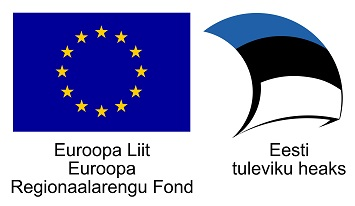

<!--# Introduction-->

SiVa is digital signature validation web service that provides SOAP and JSON
API to validate following file types:

 * Older Estonian digital signature files with DDOC extension
 * BDOC containers with `TimeMark` and `TimeStamp` signatures
 * Digitally signed PDF files
 * X-Road security server ASiCE signature containers

Architecture document main purpose is to give overview what SiVa is.
Give an overview of it's internal processes and provide information
when deploying it to production environment.

## SiVa architecture document sections overview

Below list will give You an overview of what each section of the
SiVa architecture document will cover:

* [**Overview**](siva/overview) - gives overview what SiVa is and
  it's main features.
* [**Regulatory environment**](siva/regulatory_environment) - legal analysis
  and standards that are used when building SiVa application
* [**Component diagram**](siva/component_diagram) - gives overview of
  main SiVa subsystems and and and base validation Java libraries
  used for different validation services
* [**Deployment view**](siva/deployment_view) - gives general overview of
  servers required when deploying SiVa validation web service
  into production
* [**Interfaces**](siva/interface_description) - Description of SiVa
  SOAP and JSON API request and response
* [**Use cases**](siva/use_cases) - describes main processes in SiVa
  validation web service
* [**Deploying**](siva/deployment) - how to build, deploy and configure
  SiVa web service
* [**Logging**](siva/logging) - how to configure and setup SiVa validation
  service logging support
* [**QA Strategy**](siva/qa_strategy) - overview of quality assurance strategy
* [**Test Plan**](siva/test_plan) - overview of test planning

## Download documentation

* [**Download SiVa documentation as PDF**](http://open-eid.github.io/SiVa/pdf-files/siva.pdf)

