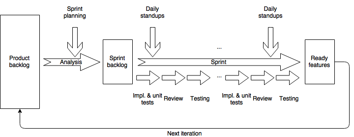

<!--# Quality Assurance -->

## QA Strategy

## Introduction

The goal of this document is to give general overview of the used infrastructure, processes, schedule and actions to ensure good quality delivery. The document describes activities in the whole software development process. Analysis, development and testing are separated for the sake of structure and transparency although they are integral parts of the development cycle.
This is living document and will be constantly updated as the project evolves.

## Environments and infrastructure


There are different test environments for quality assurance, depending on the nature and aim.

  1. TravisCI environment for public CI - Platform: Linux
  2. Test environment for local test and load test - Platform: Linux

Instructions how to set up test enviroment and run tests together with more info can be found in [SiVa GitHub page](https://github.com/open-eid/SiVa)

System requirements:

  * At least 2GB of RAM on machine where the build is executed
  * Minimum required Java version is Java 8
  * SiVa project provided Maven Wrapper (./mvnw)

Tools used:

  * TravisCI – is a continuous integration service used to build and test software projects hosted at GitHub
  * Jenkins – is an open source continuous integration tool written in Java.
  * JMeter – tool for creating and running load tests.
  * IntelliJ IDEA – is a Java integrated development environment(IDE) for developing and executing automated tests locally
  * Apache Tomcat - is an open source servlet container developed by the Apache Software Foundation.
  * Docker – is an open-source project that automates the deployment of applications inside software containers, by providing an additional layer of abstraction and automation of operating-system-level virtualization on Linux.
  * Rest-Assured - is a Java DSL(Domain-specific language) for simplifying testing of REST based Services built on top of HTTP Builder.

## Analysis

Analysis will be tagged with identificators to enable cross-reference between requirements and corresponding tests. This includes both functional and non-functional requirements. Analysis of specific tasks must be done before the sprint planning meeting. This will ensure that upcoming sprint is planned in common grounds.

See documents[(2) and (3) in References](/siva/references/)

## Development

### Development process

Customized iterative process similar to SCRUM is used in the development. The process consists of following elements:

  * Product backlog is maintained
  * Sprints are two weeks long
  * Sprint planning meetings are held
  * Tasks are maintained through JIRA SCRUM board
  * Daily team stand-ups are held
  * Tasks marked done are developed, tested and ready to be shipped
  * Bi-weekly meetings are held to give status on progress and discuss open questions
  * Retrospectives are held at least with two month intervals



### Issue lifecycle

Each ticket (defect, task, ...) in JIRA SCRUM board goes through the following states that correspond the development procedure described in previous chapter.


Description of states:

  * ToDo - tickets to be dealt with in current sprint (Sprint backlog).
  * Analysis -ticket is being analysed. During this stage requirements are refined.
  * Development - ticket is being handled (feature coding, document writing, ...).
  * In Review - the work done in development stage is being reviewed.
  * Test - ticket is being tested.
  * Done - ticket has been tested and deemed sufficient for release (Ready features)
  * Closed - ticket has been released.

### QA activities and quality criterias in the development

**Process improvement**

The development process is constantly monitored and adjusted to the changing situations. Retrospective meetings for process feedback are held.

**Unit tests**

It is responsibility of developer to write, maintain and execute the unit tests on developed features. The code must compile and pass unit tests before it is allowed to be submitted to the code repository.  The code of the unit tests is integral part of the source code and is maintained on the same principles.

Unit tests are also automatically executed on each build, if the unit tests do not pass further test execution is stopped.

**Static testing/code reviews**

All changes (including changes in unit test code) are reviewed by another development team member using GitHub. The code must pass review before it is submitted to testing.

SonarLint is used to validate code automatically. It integrates both suggested tools mentioned in reference document [(3) References](/siva/references/)

## Testing

### Approach and schedule

Testing follows the principles described in reference document [(1) in References](/siva/references/)

The goal is to automate as much of the testing process as possible, however some aspects of the testing will be carried out manually.

As the development is carried out validation module by validation module, testing will follow the same principle. The tests will be developed in iterations for each validation module.

After each iteration test cases, test automation code and test results will be available through GitHub.

The main focus on testing is on different type of input data, the tests themselves will be based on the same principle for all the modules.

The schedule of testing can be seen on the image below.


### Testing process

All automatic tests, except load tests will follow the same execution process. The tests are ran automatically during the project build process by Travis CI after each code change push in GitHub.


### Test case management

Test cases are handled as integral part of test automation code. The same applies on manual tests, in manual test cases some portion of automation may be used to execute the tests but the results are verified manually. All the test cases and test code will be maintained in the GitHub.

Test cases are developed and maintained together with test automation code by the QA specialist for Integration and System Testing.

Following elements will be present in test cases:

  * TestCaseID: unique ID that makes possible to identify specific test case
  * TestType: Automated or Manual
  * Requirement: Reference to the requirement that is tested
  * Title: Description of the test
  * Expected Result: expected outcome of the test (pass criteria for the test)
  * File: input test file that is used

**Test case sample**

Automatic and manual test cases will have the same description principles (shown below).

```bash
    /**
     * TestCaseID: Bdoc-ValidationFail-27
     *
     * TestType: Automated
     *
     * Requirement: http://open-eid.github.io/SiVa/siva/appendix/validation_policy/#common-validation-constraints-polv1-polv2
     *
     * Title: Bdoc 	OCSP response doesn't correspond to the signers certificate
     *
     * Expected Result: The document should fail the validation
     *
     * File: NS28_WrongSignerCertInOCSPResp.bdoc
     */
    @Test
    public void bdocWrongSignersCertInOcspResponse() {
        setTestFilesDirectory("bdoc/live/timemark/");
        post(validationRequestFor("NS28_WrongSignerCertInOCSPResp.bdoc"))
                .then()
                .body("signatures[0].indication", Matchers.is("TOTAL-FAILED"))
                .body("signatures[0].subIndication", Matchers.is("TRY_LATER"))
                .body("signatures[0].errors.content", Matchers.hasItem("No revocation data for the certificate"))
                .body("validSignaturesCount", Matchers.is(0));
    }
```

### Defect management

All found defects will be reported and handled in Jira. The defect report will follow similar lifecycle in JIRA SCRUM board as tasks.

The report will have following elements:

  * Title: Short, precise description of the problem
  * Details: Type, Priority, Sprint, Epic Link, Fix Version/s
  * Description:
	* **Steps to reproduce bug** - sequence for reproduction, link to test case if applicable.
	* **Expected behavior** - expected outcome of the test sequence.
	* **Actual behavior** - actual result of the test sequence. The description should be thorough enough to enable the debugging of the problem and to give objective base for severity assessment.
	* **File attachments** - Test files, logs, images, ...

### Test levels

**Integration testing**

The scope of the tests is illustrated on the image below. The goal is to test the SiVA application API (both X-Road and REST/JSON) and to test the independent module capability for validation of specific type of file (DDOC, BDOC, PDF or X-Road signature). Both valid and invalid inputs are tested. More info about testing specifics can be found in Test Plan [Integration testing](/siva/test_plan/#integration-test-introduction) section.


**System testing**

The scope of the tests is illustrated on the image below. The goal of the test is to test the entire length of signature validation process and to test supportive functions. In addition Demo application is tested. More info about testing specifics can be found in Test Plan [System testing](/siva/test_plan/#system-test-introduction) section.


**Regression testing**

Regression testing will consist of two parts:
Running all automated tests (unit, integration and system tests)
Manual testing of the areas that are not covered by automatic tests based on the regression test checklist

## Test Plan
## Integration Test introduction

This section of the document gives overview of Integration Testing carried out on SiVa web service and SiVa Sample application.

SiVa web service Integration Testing is using RestAssured library v2.5.0 to implement automatic checks for REST/SOAP based tests.

The testing of the SiVa web service is divided into sections based on the software architecture and functionalities provided to the users. The sections are:

  * REST API
  * SOAP API
  * DDOC signature validation
  * BDOC signature validation
  * PDF signature validation
  * X-Road ASICE signature validation

The goal is to focus testing on functionalities implemented in SiVa web service application. Functionalities provided by [Validation libraries](/siva/overview/#validation-libraries) are not explicitly tested.

In addition SiVa Sample Application is tested. These tests are carried out manually.

## Testing of REST API

The goal of the REST API testing is to check that the API is accepting the requests based on the specification and the output result (Validation Report) is in correct format and has all the required elements.

### Validation REST API tests

Following areas are tested on input:

  * Wrong (not accepted) values in input parameters
  * Empty values in input paramters
  * Too many parameters
  * Too few parameters
  * Inconsistencies on stated parameters and actual data (wrong document type)
  * Case insensitivity on parameter names
  * Empty request


In all of the negative cases correctness of returned error message is checked.

Specific test cases and input files can be found in:

  * [ValidationRequestIT.java](/siva/appendix/test_cases/#validationrequestitjava)
  * [DocumentFormatIT.java](/siva/appendix/test_cases/#documentformatitjava)


### Validation Report tests

SiVa web service returns uniform Validation Report on all the supported document types. This also includes correct document types without actual signature (for example PDF document without signature). However not all values may be present for all the document types.

Following areas are tested on output (Validation Report):

  * JSON structure on DDOC, BDOC, PDF, ASIC-E and ASICE-E X-Road document types
  * Presence of the mandatory elements on DDOC, BDOC, PDF, ASIC-E and ASICE-E X-Road document types
  * Presence of optional elements on DDOC, BDOC, PDF, ASIC-E and ASICE-E X-Road document types
  * Verification of expected values
  * JSON structure on containers without signatures

Specific test cases and input files can be found in:

  * [ValidationReportValueVerificationIT.java](/siva/appendix/test_cases/#validationReportValueVerificationitjava)

## Testing of SOAP API

The goal of the SOAP API testing is to check that the API is accepting the requests based on the specification and the output result (Validation Report) is in correct format and has all the required elements. In general the tests follow the same principles as with REST API.
Compatibility with X-Road security server is out of scope for these tests and will be covered in X-Road System Test plan.

### Validation SOAP API tests

Following areas are tested on input:

  * Wrong (not accepted) values in input parameters
  * Empty values in input paramters
  * Too many parameters
  * Too few parameters
  * Inconsistencies on stated parameters and actual data (wrong document type)
  * Case insensitivity on parameter names
  * Empty request


In all of the negative cases correctness of returned error message is checked.

Specific test cases and input files can be found in:

  * [SoapValidationRequestIT.java](/siva/appendix/test_cases/#soapvalidationrequestitjava)


### Validation Report tests

SiVa web service returns uniform Validation Report on all the supported document types. This also includes correct document types without actual signature (for example PDF document without signature). However not all values may be present for all the document types.

Following areas are tested on output (Validation Report):

  * Presence of the mandatory elements on DDOC, BDOC, PDF, ASIC-E and ASICE-E X-Road document types
  * Presence of optional elements on DDOC, BDOC, PDF, ASIC-E and ASICE-E X-Road document types
  * Verification of expected values

Specific test cases and input files can be found in:

  * [SoapValidationReportValueIT.java](/siva/appendix/test_cases/#soapvalidationreportvalueitjava)


## Testing of DDOC signature validation

The goal of the DDOC signature validation testing is to check that the validation results given by JDigiDoc library are properly presented in validation report.

The testing of DDOC signatures consists of following main cases:

  * Containers with valid signature(s) are validated.
  * Containers with invalid signature(s) or no signature are validated
  * Containers sizes near maximum are validated
  * Containers with DDOC v1.0 - 1.3 are validated

Specific test cases and input files can be found in:

  * [DdocValidationFailIT.java](/siva/appendix/test_cases/#ddocvalidationfailitjava)
  * [DdocValidationPassIT.java](/siva/appendix/test_cases/#ddocvalidationpassitjava)
  * [LargeFileIT.java](/siva/appendix/test_cases/#largefileitjava)

**What is not tested:**

  * Verification of different causes in container for invalid result is out of scope.


## Testing of BDOC signature validation

The goal of the BDOC signature validation testing is to check that the validation results given by DigiDoc4J library are properly presented in validation report.

The testing of BDOC signatures consists of following main cases:

  * Containers with valid signature(s) are validated
  * Containers with invalid signature(s) or no signature are validated
  * Containers sizes near maximum are validated

Specific test cases and input files can be found in:

  * [BdocValidationFailIT.java](/siva/appendix/test_cases/#bdocvalidationfailitjava)
  * [BdocValidationPassIT.java](/siva/appendix/test_cases/#bdocvalidationpassitjava)
  * [LargeFileIT.java](/siva/appendix/test_cases/#largefileitjava)

**What is not tested:**

  * Verification of different causes in container for invalid result is out of scope.


## Testing of PDF signature validation

Portion of the validation rules for PDF documents are implemented in SiVa web apllication itself. Therefor different test area selection is used for PDF compared to other containers.

The testing of PDF signatures consists of following main cases:

  * Containers with invalid signature(s) (different reasons for failure) are validated
  * Containers with no signature are validated
  * Containers sizes near maximum are validated
  * Containers with different baseline profiles are validated
  * Containers with serial and parallel signatures are validated
  * Containers with different signature cryptocaphic algorithms are validated
  * Containers with OCSP values inside and outside bounds are validated

Specific test cases and input files can be found in:

  * [PdfBaselineProfileIT.java](/siva/appendix/test_cases/#pdfbaselineprofileitjava)
  * [PdfSignatureCryptographicAlgorithmIT.java](/siva/appendix/test_cases/#pdfsignaturecryptographicalgorithmitjava)
  * [PdfValidationFailIT.java](/siva/appendix/test_cases/#pdfvalidationfailitjava)
  * [PdfValidationPassIT.java](/siva/appendix/test_cases/#pdfvalidationpassitjava)
  * [LargeFileIT.java](/siva/appendix/test_cases/#largefileitjava)

## Testing of X-Road ASICE signature validation

The goal of the ASICE signature validation testing is to check that the validation results given by X-Road signature validation utility are properly presented in validation report.

The testing of ASICE signatures consists of following main cases:

  * Containers with valid signature(s) are validated
  * Containers with invalid signature(s) are validated

Specific test cases and input files can be found in:

  * [XroadValidationPassIT.java](/siva/appendix/test_cases/#xroadvalidationpassitjava)
  * [XroadValidationFailIT.java](/siva/appendix/test_cases/#xroadvalidationfailitjava)

**What is not tested:**

  * Verification of different causes in container for invalid result is out of scope.

## Testing of user statistics

Testing of user statistics is carried out in combination of automatic data preparation and generation by integration tests and manual verification of the results.
SiVa supports two parallel ways of gathering user statistics:

  * Validation results are printed to system log and can be gathered by any suitable means
  * Validation results are sent to Google Analytics using Google Measurement Protocol API

!!! Note

	Testing of Google Analytics requires creation and configuration of Google Analytics account and configuring SiVa service to send statistics to this account. Configuration of SiVa service is explained in [SiVa system deployment.](/siva/v2/deployment/#siva-system-deployment)

As both systems use the same data the testing follows the same principles for both. Following areas are covered:

  * Statistics values are checked in log and Google Analytics for all container types (this also includes parameters not present in validation report)
  * Valid and invalid signatures are validated
  * Error situations on signature validation (instead of validation report, error message is returned)
  
Specific test cases and input files can be found in:

  * [StatisticsToGAManualIT.java](/siva/appendix/test_cases/#statisticstogamanualitjava)
  * [StatisticsToLogsManualIT.java](/siva/appendix/test_cases/#statisticstologsmanualitjava)
  
  **What is not tested:**

  * Configuring Google Analytics reports is out of scope. Only verification of data presence is done.
  
## SiVa Sample Application tests

Testing of SiVa Sample Application is done manually. The main cases are:

  * Cross browser usage (IE, Edge, Chrome, Firefox and Safari)
  * File upload (different sizes, suported and unsupported file types)
  * Displayment of Validation Report both for REST and SOAP
  * Layout of the page
  * Error representation 
  
## System Test introduction

While Integration Tests were mostly carried out automatically then System Testing is mostly depending on manual testing.

System testing is carried out using two access points:

  * Testing through SiVa Sample Application
  * Testing through X-Road security server using SoapUI

!!! Note
 
	Testing through X-Road security server requires presence and configuration of X-Road security server to use SiVa service.  Tests are run using SoapUI that simulates request to X-Road security server.

## Testing through X-Road security server

Following areas are covered:

  * Validation of valid signature
  * Validation of invalid signatur
  * Validation that returns Soap error

All of the above test cases are run with BDOC, DDOC, PDF and X-Road ASiC-E containers. Tests along with test case descriptions are available for rerun in github.


## Configuration/administration testing

!!! development
	

## Load Test introduction

The goals of the load test was to:

  * Determine the throughput capabilities of a single Siva node and how it handles requests under increasing load.
  * Test whether the SiVa service throughput is horizontally scalable up to 50 requests per second.

Each container type was load-tested separately since the business logic and underlying mechanics for validating specific container types are vastly different.

Load tests were run in three stages – firstly a single Siva service node was tested to determine the baseline performance metrics. Second and third stage involved adding additional service node to previous setup and testing the horizontal scalability performance.
All three target Siva service nodes had identical virtual machine set-up. Virtual machines were installed on separate physical hardware.
Siva web service nodes on a target Linux virtual machine were packaged inside a Docker container (along with Java with 4 GB allocated for Heap). The test runner (JMeter plugin used by Maven) resided on a separate machine on local area network. Simple reverse proxy was used as a load balancer to distribute the load between nodes (using round robin algorithm).

Load testing is carried out on following environments:

  * System under test enviroment (processor: Intel(R) Xeon(R) CPU E5-2620 v3 @ 2.40GHz memory: 10GB (4GB allocated for Java heap))
  * Load balancer enviroment (processor: Intel(R) Xeon(R) CPU E5-2620 v3 @ 2.40GHz memory: 13GB)
  * Jmeter executer enviroment (processor: Intel(R) Xeon(R) CPU E5-2620 v2 @ 2.10GHz memory: 6GB)

Following test data is used in load test:

  * BDOC-TS file with two valid signatures (~100KB and 5MB)
  * BDOC-TM file with two valid signatures (~100KB and 5MB)
  * PDF file with two valid signatures (~200KB and 5MB)
  * DDOC file with two valid signatures (~300KB and 5MB)
  * ASIC-E X-Road container with one valid signature (~10KB)

Each of the files are validated through REST interface. SOAP interface is used with small files for a comparison. It is evaluated that the interface (REST or SOAP) do not play noticeable effect on overall results.

Each of the tested files follow the same test plan:

  * Five concurrent requests are made per second
  * This load is held for period of time
  * Concurrent requests are increased by five until 50 concurrent requests per second is achieved
  * Latency and throughput is measured on each concurrent request steps


