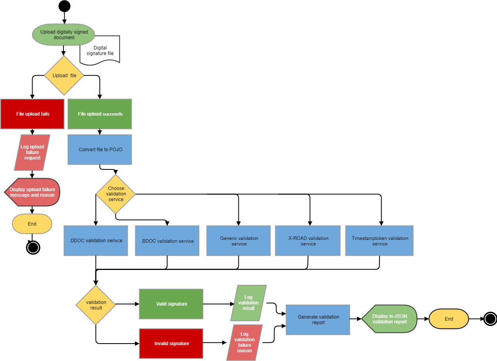
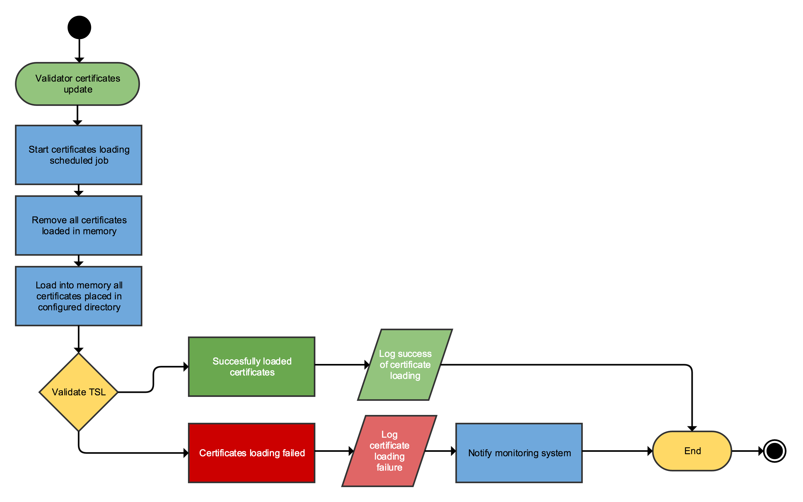
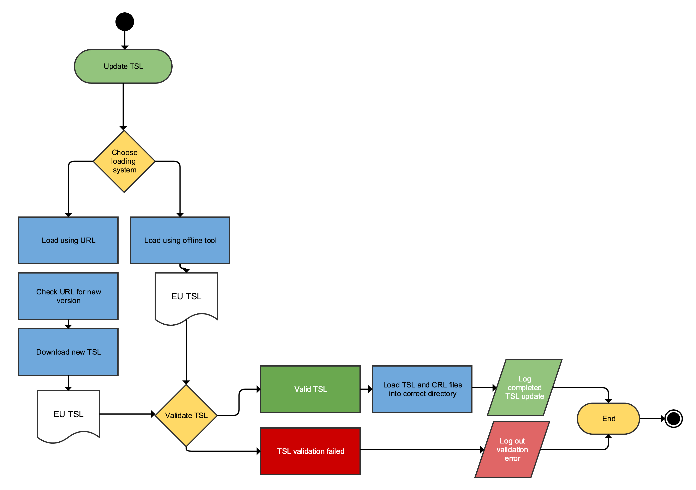
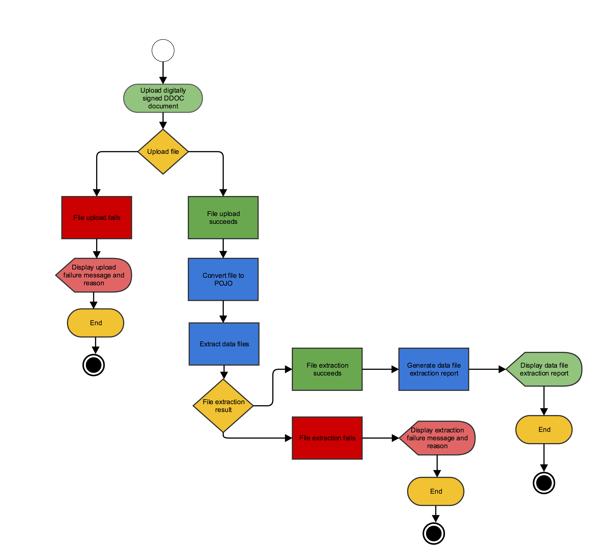

## Digitally signed document validation process

Digitally signed document validation process shows how SiVa chooses
validation service and possible output of validation process.

User of SiVa system provides digitally signed document file in form of
Base64 encoded string. The validation of file and validation policy
is handled by validation services underlying libraries.

* In case of DDOC containers with XAdES signatures it will be Ddoc Validation Service
* In case of BDOC containers with XAdES signatures it will be Bdoc Validation Service
* In case of X-ROAD ASIC-E containers with XAdES signatures it will be Xroad Validation Service
* In case of ASIC-S containers with TimeStampToken it will be Timestamptoken Validation Service
* In case of other containers or with XAdES, CAdES and PAdES signatures it will be Generic Validation Service

We will log following failure cases:
When file upload fails (request started but was not completed successfully)
When request validation (JSON or SOAP) fails
When user authentication fails - **not shown in diagram above**
When signature validation fails – **not shown in diagram above**
When increasing of request count fails – **not shown in diagram above**

## Certificate loading process

All validation services require certificates to validate digitally signed
documents. Below process shows how certificates are loaded into
validation service. Loading process is done separably for each validation
service.

Certificate loading process is scheduled cron job inside each validation
service to update currently in memory loaded certificates.

This process should run after TSL loader has completed updating
SiVa local copy of certificates.

## X-Road 6 security server SOAP request process

X-Road validation process is brought out because we skip authentication
process for X-Road security server interface and and use XML SOAP
as input source.

Validation of SOAP request XML is done in the SiVa web application module.
Document validation process is described in detail in [Digitally signed document validation process](#digitally-signed-document-validation-process)
Validation report output id described in [Interface description](../siva2/interfaces)

## TSL loading use case

TSL implementd in seprate module. The process is executed in two ways.

* When SiVa application is started
* As scheduled job

Loading process is required action when ASiCE (BDOC) or

## DDOC data file extraction process

DDOC data file extraction process shows how SiVa extracts data file(s)
from container and possible output of data file extraction.

User of SiVa system provides digitally signed DDOC file in form of
Base64 encoded string. The extraction of data files is handled by
underlying JDigiDoc library.

We will log following failure cases:
When file upload fails (request started but was not completed successfully)
When request validation (JSON or SOAP) fails.
